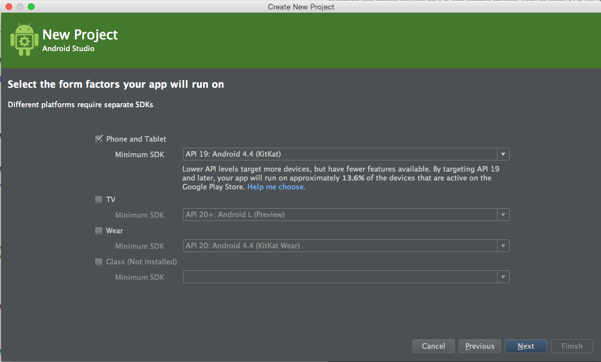
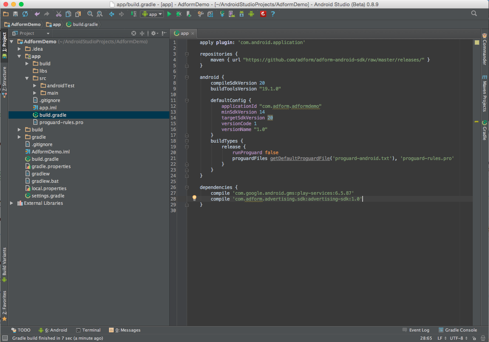
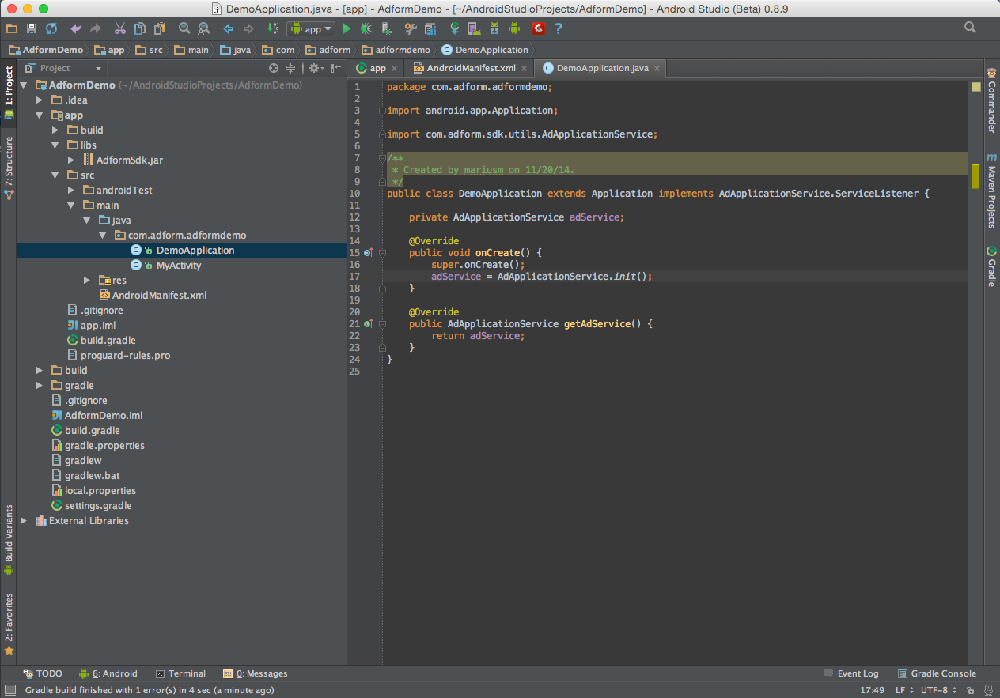
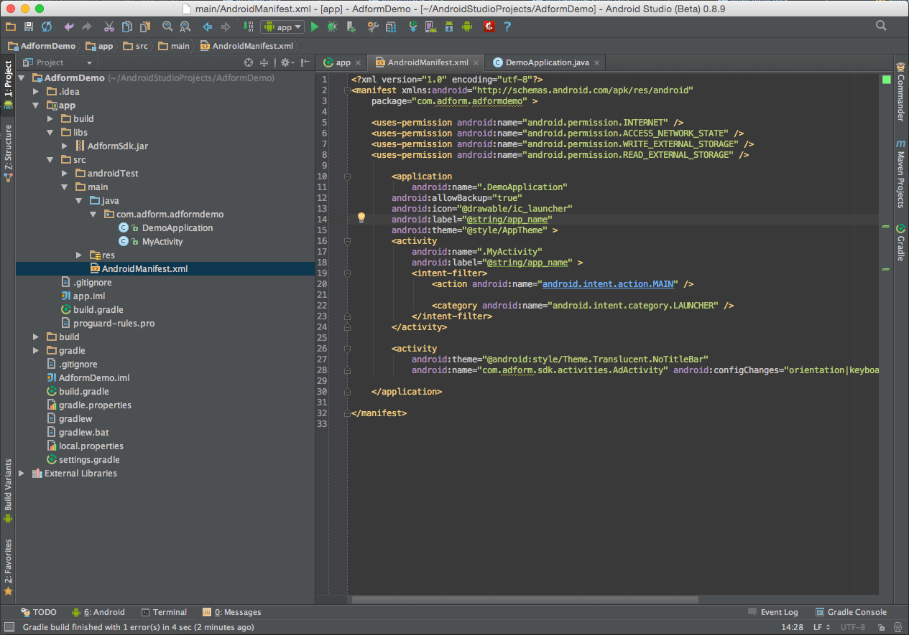
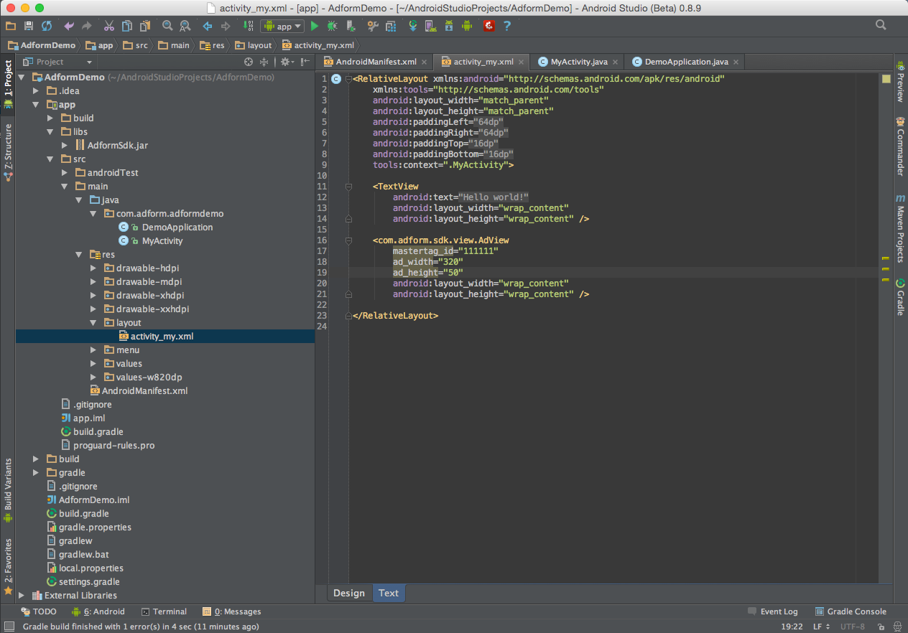
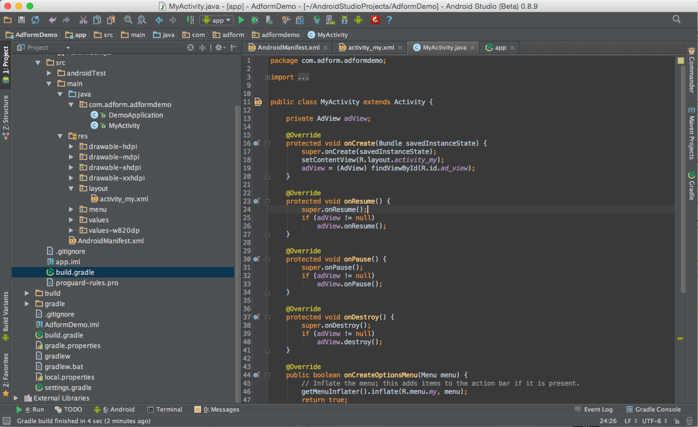
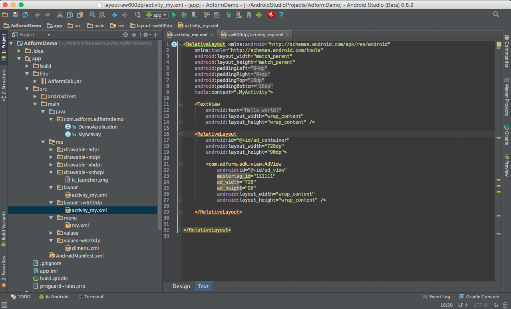
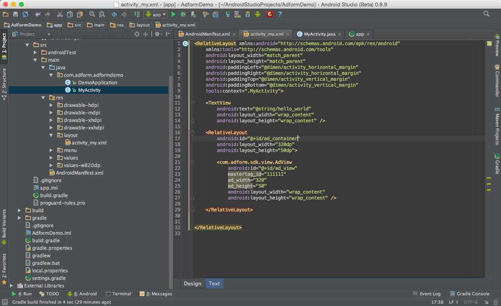
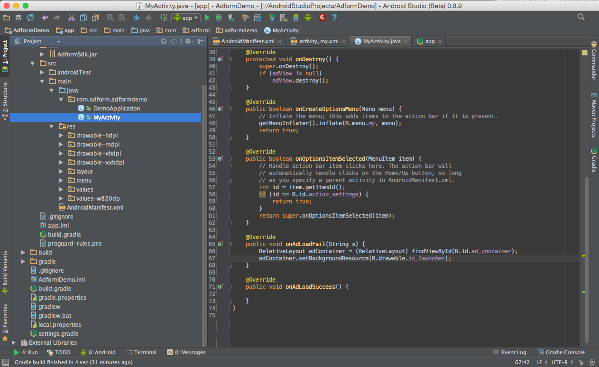

# Getting Started

Adform brings brand advertising to the programmatic era at scale, making display advertising simple, relevant and rewarding!

## 1. General Info

* AdformSDK runs on Android 4.0, so created project version should be 4.0 and above.

* The instructions described here are done on Android studio. These instructions should also be compatible with Intelli J.

## 2. Setting up library dependencies

* To add a library to the dependencies, first we need to specify repository location. This can be done by editing `build.gradle` file and by inserting snippet (specified below) right above the `android` configuration group. 

	    ...
		repositories {
    		maven { url "https://github.com/adform/adform-android-sdk/raw/master/releases/" }
		}
        ...

* Then in the dependency group we need to specify that we will be using `AdformSdk`, and also add `Google Play` services.
		
	    ...
        dependencies {
		    compile 'com.google.android.gms:play-services:6.5.87'
			compile 'com.adform.advertising.sdk:advertising-sdk:1.0.2'
        }
        ...
        
* How to add Google Play Services to Your Project please follow these instructions: https://developer.android.com/google/play-services/setup.html#Setup

## 3. Extend Application class

For the SDK to work properly, you need to extend a default or use already created  `Application` class and add two steps.

* Initialize service by adding `adService = AdApplicationService.init();`
* Implement `AdApplicationService.ServiceListener` interface.

## 4. Update AndroidManifest.xml

Update `AndroidManifest.xml` with additional information.

* Add internet reachability and external storage permissions. This can be done by inserting snippet shown below between the `<manifest></manifest>` tags.

        <uses-permission android:name="android.permission.INTERNET" />
        <uses-permission android:name="android.permission.ACCESS_NETWORK_STATE" />
        <uses-permission android:name="android.permission.WRITE_EXTERNAL_STORAGE" />
        <uses-permission android:name="android.permission.READ_EXTERNAL_STORAGE" />
		    
* The SDK needs an additional window to display its various states. To do that, insert snippet shown below between `<application></application>` tags.

		<activity
                android:theme="@android:style/Theme.Translucent.NoTitleBar"
                android:name="com.adform.sdk.activities.AdActivity" android:configChanges="orientation|keyboard|keyboardHidden|screenSize|screenLayout|uiMode"/>

* Sign app to use earlier created application class by adding `android:name=".DemoApplication"` in `<application>` properties.

        <application
            android:name=".DemoApplication"...      
        

And you're set!

# Sample Integrations

## Basic AdformSDK Banner View implementation

### Preparing view in xml

To add a banner view, insert a view with a path of `com.adform.sdk.view.AdView`. For the view to load an ad, you need to:

* Define a master tag id by adding `mastertag_id`
* Define banner size by adding `ad_width` and `ad_height`. 

An example of view insert into a layout can be found below:

	<com.adform.sdk.view.AdView
	        android:id="@+id/custom_ad_view"
	        mastertag_id="111111"
	        ad_width="320"
	        ad_height="50"
	        android:layout_width="wrap_content"
	        android:layout_height="wrap_content"
	        android:gravity="center_horizontal" />

### Preparing view in programmable code

For the SDK to work properly, a set of events ( **destroy**, **return**, **pause** ) should be provided from the Fragment/Activity. This can be done by doing these steps: 
	
1. Get created view instance

		adView = (AdView) view.findViewById(R.id.custom_ad_view);

2. Report **onDestroy**, **onResume**,**onPause** events to the view

        @Override
        protected void onDestroy() {
            super.onDestroy();
            adView.destroy();
        }
    
        @Override
        protected void onResume() {
            super.onResume();
            adView.onResume();
        }
    
        @Override
        protected void onPause() {
            super.onPause();
            adView.onPause();
        }

3. When ad is ready, use `loadAd()` to start loading.

		adView.loadAd();
	
	Because ad needs to be initialized before using this (`onResume()` must be called first), there are some cases that cant cover this. So to force ad loading, use `forceLoadAd()` instead.
	
		adView.forceLoadAd();

Note that master tag id and size parameters can be set from programmable code too.

* To set master tag you need to use 

		adView.setMasterTagId(111111);
		
Same goes for size parameters. 

* To set them, you can use class `AdSize`. 

		adView.setAdSize(new AdSize(320, 50));

Thats it! You are ready to go.

### Adding custom values to AdformSDK

To add custom values with the add, you can use a static class `AdformSDK` and its method `setPublisherIdAndCustomData(int, HashMap<String ,String>)`. 

Note that #1 parameter is publisher id and #2 is a set of custom data. 

        // Use builder to set custom parameters...
        AdformSDK.setPublisherIdAndCustomData(666666, CustomParamBuilder.startCreating()
                        .addCustomParam("gender", "female")
                        .addCustomParam("age", "23")
                        .buildParams()
        );        

### Adding basic event listeners

To add an event listener to a class, first the class must declare an `AdListener` interface...

		public class DemoFragment1 extends Fragment implements AdListener ...

...implement its interface...

		@Override
    	public void onAdLoadSuccess() {
			// Load succeeded event
    	}

    	@Override
    	public void onAdLoadFail(String failError) {
        	// Load failed event
    	}

...and bind the Ad view as the interface listener

		adView.setListener(this);
		
### Adding support for different devices (tablets, phones)

The easiest way to add support for tablet and phone devices is to import different xml's for both screen types. To do that, in addition to default layout, add an xml layout for larger screen type, for e.g.  add a folder `layout-sw600dp` that targets tablet devices with smallest screen of 600dp and add an xml layout with different banner size to it.

        <com.adform.sdk.view.AdView
            android:id="@+id/ad_view"
            mastertag_id="111111"
            ad_width="728"
            ad_height="90"
            android:layout_width="wrap_content"
            android:layout_height="wrap_content" />
 

For more information use the link below.
http://developer.android.com/guide/practices/screens_support.html

		
### Fallback case
		
The most common case to replace SDK with fallback image in case of failure is to add view into container.

And change container background whenever there is a failure when loading an ad.

And the result will be image fallback:

### Adding additional event listeners

There are more events that can be received when implementing `AdStateListener` interface.
At the moment, only `onAdVisibilityChange` event can be captured, but in the future there will be additional events:

* onAdStateChange
* onAdSizeChange
* onAdPlacementChange
* onCurrentPositionChange

Implementing `AdStateListener` is similar to implementing basic listeners. We declare that class answers to `AdStateListener` interface...

	public class DemoFragment1 extends Fragment implements AdStateListener...

...implements its events...

    @Override
    public void onAdVisibilityChange(boolean isVisible) {
        // Ad view visibility changed event
    }

...and lastly bind the Ad view to the interface listener

	adView.setStateListener(this);

### ListView implementation

For more complicated implementation like ListView, a view should always have a **unique ID** and a flag indicating that it is loaded from listview. This should be done like in example below:

	<com.adform.sdk.view.AdView
			android:id="@+id/custom_ad_view"
			android:layout_width="wrap_content"
			android:layout_height="wrap_content"
			ad_width="320"
			ad_height="50"
            mastertag_id="3987056"
            listview_item="true"
			/>

When implementing an ad into ListView you should **NOT** pass in events such as `onReturn`, `onPause`, `destroy` like in normal view.

## Basic interstitial implementation

To load an interstitial ad, a `AdViewInterstitial` class should be used. Before loading an interstitial ad, first it must be initialized.

	AdViewInterstitial adLoader = AdViewInterstitial.createInstance(getActivity());
		
Then you should define master a master tag id. 
		
    adLoader.setMasterTagId(123456);
    
This class has two methods that can be used to display an interstitial: 

* loadAd() - used to load an ad, and store its contents into memory for later quick use. This is useful if an ad has lots of resources to load. 
* showAd() - used for showing an ad. If the ad is not loaded, it loads internally and displays it as soon as the ad is loaded.

You can find an example below how these functions are used with simple button events.

    @Override
    public void onClick(View v) {
        switch (v.getId()) {
            case R.id.load_button: {
                adLoader.loadAd();
                break;
            }
            case R.id.show_button: {
                adLoader.showAd();
                break;
            }
        }
    }

Like in normal view, interstitial also has events that need to be called from outside. Those events are `destroy`, `saveInstanceState`, `restoreInstanceState`.

* **destroy** should be called in its similar method `onDestroy`.

	    @Override
    	public void onDestroy() {
        	adLoader.destroy();
        	super.onDestroy();
    	}

* **saveInstanceState** should be called in `onSaveInstanceState`.
    
	    @Override
    	public void onSaveInstanceState(Bundle outState) {
        	super.onSaveInstanceState(outState);
        	adLoader.saveInstanceState(outState);
    	}

* **restoreInstanceState** should be called in whenever state is restored. Like in `onCreate` or `onActivityCreated` methods, that has a parameter of savedInstanceState.

    	@Override
    	public void onCreate(Bundle savedInstanceState) {
        	super.onCreate(savedInstanceState);
        	adLoader = AdViewInterstitial.createInstance(getActivity());
        	adLoader.restoreInstanceState(savedInstanceState);
    	}
    
## Advanced interstitial implementation

An `AdViewInterstitial` has more advanced features such as instance saving, loading into a view, and its callback event listeners. These features are an addition to the basic implementation.

### Using animation

Interstitial Ad can be shown with/without an animation by providing `useAnimation` flag. This can be done by using `setUseAnimation(boolean);` 

### Callback listeners

To get ad loader state `setListener(AdViewInterstitial.InterstitialLoaderListener)` should be used to get events when loading has succeeded/failed.

    adLoader.setListener(new InterstitialAdLoader.InterstitialLoaderListener() {
        @Override
        public void onInterstitialLoadError(String error) {
			// Error event implementation
        }

        @Override
        public void onInterstitialLoadSuccess() {
			// Success event implementation
        }
    });
    